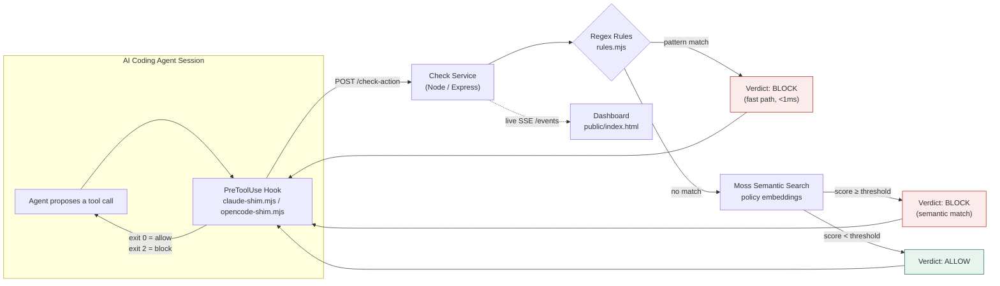

<div align="center">

```
                              _   
                             | |  
     /\                      | |  
    /  \   _ __   ___| |__   ___  _ __
   / /\ \ | '_ \ / __| '_ \ / _ \| '__|
  / ____ \| | | | (__| | | | (_) | |
 /_/    \_\_| |_|\___|_| |_|\___/|_|

        ⚓  A N C H O R  ⚓
   Real-time guardrails for AI agents
```

</div>

<p align="center">
  <em>Stops an AI coding agent's dangerous actions before they execute — locally, in milliseconds, with no cloud round-trip.</em>
</p>

<p align="center">
  
</p>

---

## What this is

Agent Anchor is a **pre-execution firewall for AI coding agents** (Claude Code, opencode, and similar harnesses). It sits between the agent and the shell/filesystem, intercepts every proposed tool call, and blocks it before it runs if it violates policy — a destructive `rm -rf`, a force-push to `main`, a `DROP TABLE`, reading `.env`/SSH keys, piping a remote script into a shell, or a wipe of the disk.

Built for the **YC Fall 2026 — Moss Zero Latency Builder Sprint**, track: *Agent Reliability, Security and Evaluation*.

Two decision layers work together:

1. **Deterministic regex rules** — catch known-bad patterns in well under a millisecond, with zero embedding cost.
2. **Moss semantic search** — catches *rephrasings* of the same dangerous intent that no regex was written to anticipate (e.g. `shutil.rmtree(...)` instead of `rm -rf`), by matching the proposed action against a policy corpus of embedded rules.

Every check is logged and streamed live to a local dashboard, with the matched policy, the layer that caught it, and the latency in milliseconds.

---

## Tech stack

| Layer | Technology |
|---|---|
| Check service | Node.js, Express |
| Semantic retrieval | [Moss](https://usemoss.dev) — local-first vector search |
| Agent hooks | Claude Code `PreToolUse` hook, opencode `tool.execute.before` plugin |
| Dashboard | Server-Sent Events (SSE), vanilla HTML/CSS/JS — no framework |
| Packaging | Docker, docker-compose |
| CI | GitHub Actions |
| Demo data | LLM-generated (NVIDIA NIM / Gemini) action sequences |

---

## Project structure

```
Agent_Anchor/
├── .claude/
│   └── settings.json          # registers the PreToolUse hook for Claude Code
├── .github/
│   └── workflows/
│       └── ci.yml             # lint, smoke test, Docker build on every push
├── adapters/
│   └── firewall/
│       ├── firewall-core.mjs  # shared decision logic (fail-closed on error)
│       ├── claude-shim.mjs    # Claude Code PreToolUse hook (stdin → exit code)
│       └── opencode-shim.mjs  # opencode plugin (tool.execute.before)
├── service/
│   ├── server.mjs             # Express app: /check-action, /events, /health
│   ├── src/
│   │   ├── rules.mjs          # deterministic regex rule set
│   │   └── moss.mjs           # Moss index load + semantic query
│   ├── policies/
│   │   └── policies.json      # policy corpus, seeded into Moss
│   ├── scripts/
│   │   ├── seed-moss.mjs      # pushes policies.json to Moss as embeddings
│   │   └── smoke-test.mjs     # exercises every rule + Moss paraphrase case
│   ├── public/
│   │   └── index.html         # live SSE dashboard
│   ├── Dockerfile
│   └── package.json
├── docker-compose.yml
└── README.md
```

---

## Architecture



**Fail mode is closed by default** — if Moss is unreachable or misconfigured, the service blocks rather than silently allowing everything through.

---

## Getting started

Run these in order — later steps depend on earlier ones completing cleanly.

### 1. Install

```bash
git clone https://github.com/mdaashir10/Agent_Anchor.git
cd Agent_Anchor/service
npm install
```

### 2. Configure Moss

Create a project at [portal.usemoss.dev](https://portal.usemoss.dev), then create `service/.env`:

```bash
MOSS_PROJECT_ID=your_project_id
MOSS_PROJECT_KEY=your_project_key
MOSS_THRESHOLD=0.85
```

### 3. Seed the policy index

```bash
npm run seed
```

This pushes the policies in `policies/policies.json` to Moss as embeddings, under the index name `agent-firewall-policies`.

### 4. Start the service

```bash
npm start
```

Confirm the startup log shows `moss: ready`:

```
Agent Firewall service on http://127.0.0.1:3000
policies loaded: 7 | moss: ready | fail mode: closed | threshold: 0.85
```

### 5. Open the dashboard

Visit **http://127.0.0.1:3000** in a browser to watch checks stream in live.

### 6. Register the agent hook

Add `.claude/settings.json` at the repo root (already included) to wire the firewall into Claude Code's `PreToolUse` hook, or configure the equivalent in opencode. Start a real agent session in the repo and confirm a destructive action gets rejected.

### 7. Run the smoke tests

```bash
npm test
```

---

## Policies

| Rule | Catches |
|---|---|
| `no-destructive-rm` | Recursive/force delete via `rm` |
| `no-secret-files` | Reading/writing `.env`, SSH keys, AWS credentials |
| `no-force-push` | `git push --force` / `-f` |
| `no-sql-drop` | `DROP TABLE`, `DROP DATABASE`, `TRUNCATE` |
| `no-pipe-to-shell` | `curl \| sh` style remote-script execution |
| `no-disk-wipe` | `mkfs`, `dd ... of=/dev/...` |
| `no-self-tamper` | Attempts to disable or edit the firewall's own hook config |

---

## Why local-first

The check service binds to `127.0.0.1` by default and never round-trips to the cloud on the query path once Moss's index is loaded — the guardrail adds negligible latency to the agent loop and works fully offline for the rule-matched cases.

---

<p align="center"><em>Built for the Moss Zero Latency Builder Sprint — Agent Reliability, Security and Evaluation track.</em></p>
