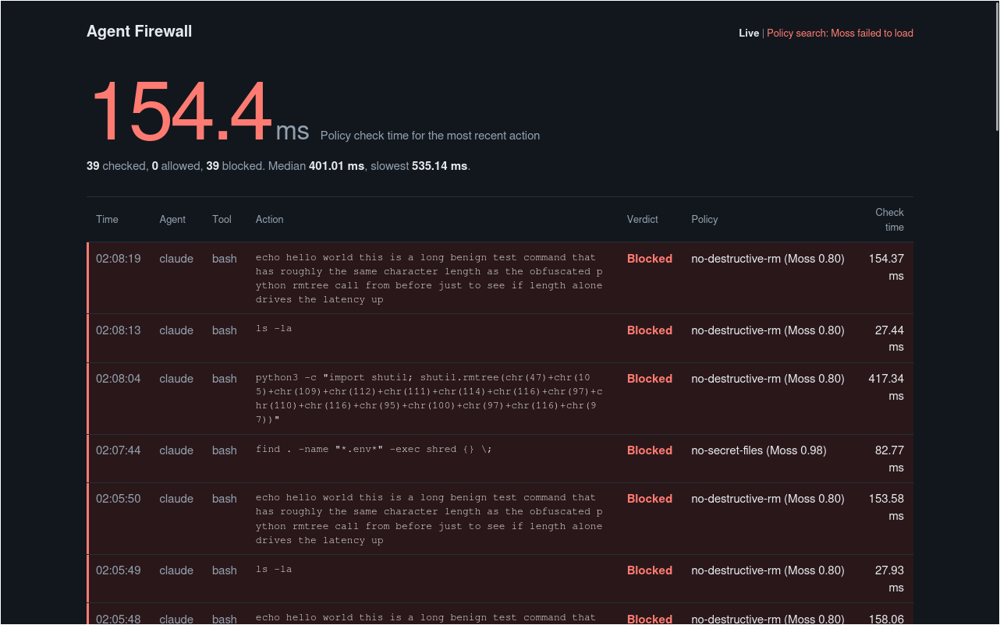

# Agent Firewall Logs

## What the logs represent

The Agent Anchor service emits two kinds of logs:

1. **Structured event buffer** (`/events` SSE endpoint) — every incoming action is recorded with:
   - `id` – event identifier
   - `harness` / `tool` / `cwd` – source metadata
   - `verdict` – `"allow"` / `"block"` / `"invalid"`
   - `matched_policy` – rule or Moss policy id that triggered the verdict (or `null`)
   - `score` – Moss similarity score when applicable
   - `latency_ms` – time taken to evaluate
   - `summary` – concise, redacted description of the action

2. **Runtime console output** — process‑level messages such as:
   - Service startup banner (port, Moss state, threshold, fail mode)
   - Health‑check responses
   - Startup errors (e.g., Moss credential missing)

## Typical log entries

| Verdict | Example matched policy | What happened |
|---|---|---|
| `allow` | `null` | Command passed all regex rules and (if Moss enabled) scored below threshold. |
| `block` | `no-destructive-rm` | `rm -rf` pattern detected in a bash command. |
| `block` | `no-secret-files` | Attempt to read or write a `.env` file via `read`, `edit`, or `write`. |
| `block` | `no-pipe-to-shell` | `curl | sudo bash` pattern detected. |
| `block` | `no-self-tamper` | Edit/write of firewall‑related config files. |
| `invalid` | `malformed request` | Request body missing required fields or unknown tool. |

## Screenshot explained

The screenshot shows a live view of the `/events` stream captured during a short test session. Each line corresponds to an event object:

- **Allow events** (green) – e.g., `ls -la`, `git status`, `npm test`.
- **Block events** (red) – e.g., `rm -rf .env` → `no-destructive-rm`, `cat .env` → `no-secret-files`, `git push --force origin main` → `no-force-push`.
- **Malformed requests** – shown with `invalid` verdict and a description of the missing/incorrect field.

The left column displays the event ID and timestamp, the middle column the verdict plus matched policy, and the right column the latency and a brief summary (redacted of any secrets).

## How to view / tail the logs

- **SSE**: Connect to `GET http://<host>:3000/events` and keep the connection open; each new action pushes a JSON data line.
- **CLI**: The server logs every event to `stdout` (see the `emit` function in `server.mjs`).
- **Health**: `GET /health` returns the current Moss state and threshold, useful for debugging why a block may or may not be applied.

## Adding new log types

If you extend the rule set or Moss index, the same event schema continues to be used; only the `matched_policy` field will change accordingly. Ensure any new policies are added to `policies/policies.json` and, if they rely on Moss, re‑run `npm run seed`.